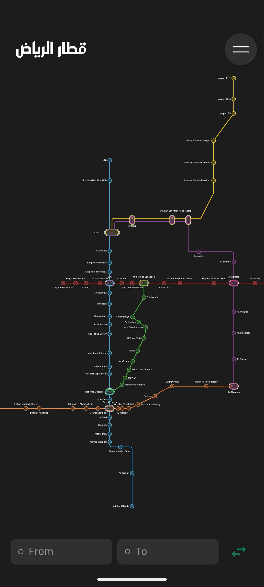
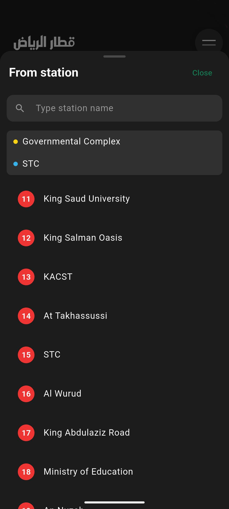
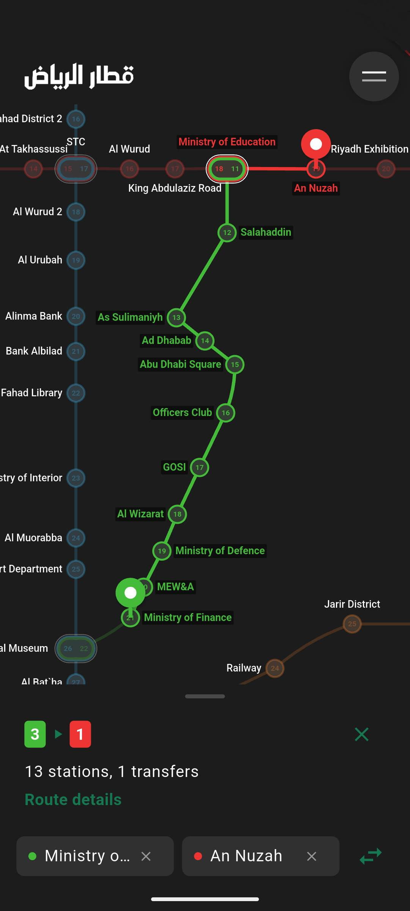
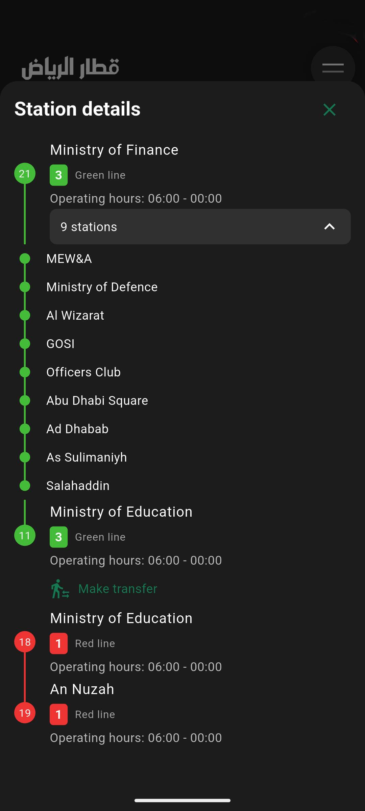

## Legal Information

Please select your preferred language to view the privacy policy and terms of use:

- [English](./en/privacy-legal.html)
- [Arabic](./ar/privacy-legal.html)

## About the Riyadh Metro App

The Riyadh Metro app is your essential companion for navigating the Riyadh metro system. Our app provides a seamless user experience with the following features:

### 🗺️ Metro Map Viewer

View the complete Riyadh Metro network with all lines, stations, and interchanges in an interactive map.

  

### 🔍 Station Search

Easily find any station on the network by name or nearby location.

  

### 🛣️ Route Planning & Navigation

Plan your journey from any station to destination, with transfer information and estimated travel times.

  

### ⏱️ Real-time Information

Get up-to-date information about operating hours for all stations.

  

